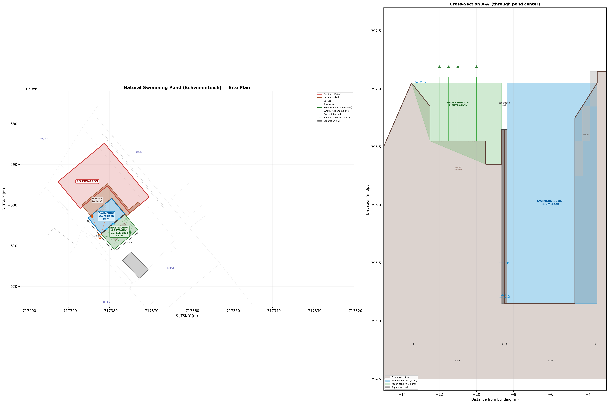
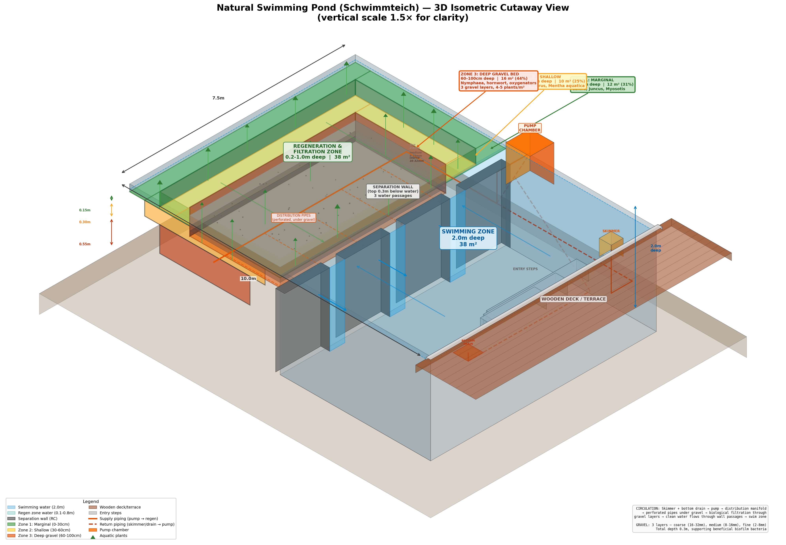

# Natural Swimming Pond (Schwimmteich) - Project Design Document

**Date:** 2026-04-11
**Site:** Parcels 154/10 and 154/16, Jevany [533378]
**Owner:** Bc. Marketa Edwards
**Coordinate system:** S-JTSK (Krovak)
**Elevation datum:** Bpv (Baltic after adjustment)

---

## Part A: Feasibility Assessment

### A.1 Key Documents and What to Use Them For

#### Primary Design Base

| Document | What it tells you | Priority |
|----------|-------------------|----------|
| **10225.dxf** (survey plan) | Terrain elevations, parcel boundaries, existing features. Base drawing for design. | Essential |
| **C.3 Situace koordinacni** | Building footprint, utility routes, setbacks. Shows where things are and what space remains. | Essential |
| **Geologicky pruzkum** (E.) | Soil layers, permeability, groundwater depth. Determines feasibility and construction method. | Essential |

#### Supporting Information

| Document | What it tells you |
|----------|-------------------|
| **C.2 Situace celkova** | Parcel areas, neighbouring parcels, access, overall layout |
| **Radon report** (E.) | Soil gas permeability, confirms soil type across site |
| **D.1.4.1.4 Schema destove kanalizace** | Existing rainwater drainage routes; potential integration |
| **D.1.4.1.1 Technicka zprava** | Water supply connection, soakaway design, pipe routes |
| **D.1.1.1 Technicka zprava** | Building technical report, finished floor levels |

### A.2 Available Space

| Metric | Value |
|--------|-------|
| Total site area | 1,091 m² |
| House footprint | 180.38 m² |
| Paved areas + terrace + garage | 170.94 m² |
| Remaining green area | **739.68 m²** (approx.) |
| Green area percentage | 84.33% (per zoning) |

The site is elongated, running roughly NW-SE from Prazska street. The house sits toward the NW corner. The majority of open space is to the **east and southeast** of the building.

### A.3 Feasibility Factors

#### Factors in Favour

1. **Plenty of space** — 740 m² of green area; the proposed 75 m² pond uses only ~10% of available space
2. **Deep water table (7 m)** — no risk of groundwater contamination or buoyancy/flotation of an empty pond
3. **Stiff clay soil (F5 ML)** — naturally low permeability; clay soils are the best natural base for ponds
4. **No public stormwater sewer** — rainwater is already managed on-site; a pond could integrate with the existing retention/infiltration strategy
5. **Sloping terrain** — allows gravity-fed circulation between regeneration and swimming zones
6. **Granite-derived soil** — chemically neutral to slightly acidic; suitable for aquatic planting

#### Factors to Address

1. **Soil permeability (kv = 5 x 10⁻⁶ m/s)** — not zero; additional sealing required (see Part B §B.4)
2. **Terrain slope** — unequal cut depths; downhill side needs retaining solutions or naturalistic grading
3. **Fill material to 1.80 m** — upper soil is anthropogenic fill (navazka); pond base should reach natural clay below
4. **Existing utility routes** — electricity 82 m, water 81 m, sewer 40 m, rainwater 57 m; pond must clear these
5. **Radon** — HIGH index (72.3 kBq/m³); not a concern for open-air pond, but enclosed pump chambers would need protection
6. **Setbacks from boundaries** — Czech regulations typically require setbacks for water features; must confirm with stavebni urad (see Part B §B.6)
7. **Winter conditions** — Jevany at ~400 m ASL; hard frosts expected; sufficient depth (2.0 m) prevents freezing solid
8. **Building proximity** — pond at 0.1 m from terrace; pond floor ~1.2 m below house foundation base (see Part B §B.5)

---

## Part B: Geotechnical Assessment

**Purpose:** Consolidate all available geotechnical data relevant to the proposed swimming pond and identify gaps requiring further investigation.

### B.1 Data Sources

All soil and geotechnical data currently available originates from the **geological survey (geologicky pruzkum)** commissioned for the house construction, stored under `E. Dokladova cast / GEOLOGICKY PRUZKUM`. The raw survey report is not included in this repository.

**Important limitation:** All geotechnical data derives from **borehole S1**, which was drilled for the house foundation investigation. This borehole is not at the proposed pond location. The soil profile at the pond location has not been independently verified.

### B.2 Soil Classification and Profile

**Classification:** F5 ML — low-plasticity silt/clay, stiff consistency throughout.

#### Borehole S1 Profile

| Layer | Depth | Classification | Description |
|-------|-------|---------------|-------------|
| I | 0.00-0.10 m | F5 ML | Topsoil / humozni hlina (humic loam fill) |
| II | 0.10-1.80 m | F5 ML Y | Strongly sandy clay, stiff consistency. **Fill material (navazka)** with feldspar, quartz, mica from granite. |
| III | 1.80-2.00 m+ | F5 ML | Light brown/pinkish weakly sandy clay, stiff consistency. **Natural deluvial soil**, granite-derived. |

**Key characteristics:**
- The entire profile is F5 ML (low-plasticity silt/clay), stiff consistency
- Mineral content (feldspar, quartz, mica) derives from the underlying Ricany-type granite
- The upper 1.80 m is anthropogenic fill (navazka), not undisturbed ground
- Natural deluvial clay only begins below 1.80 m
- The fill material (Layer II) may have variable properties across the site

**Relevance to pond:** Excavation will reach ~2.5 m maximum, passing entirely through the fill and into natural clay. The natural clay provides a more stable base. Excavated spoil (F5 ML) is reusable for compacted clay liner, berms, or grading.

### B.3 Soil Permeability

| Parameter | Value | Standard |
|-----------|-------|----------|
| Infiltration coefficient (kv) | 5.0 x 10⁻⁶ m/s | CSN 75 9010 |
| Classification | Boundary between low and medium permeability | |
| Existing soakaway performance | 16 m² active area, 67.8 hours drain-down for 9.76 m³ retention | |

**Interpretation:** A kv of 5.0 x 10⁻⁶ m/s is not sufficient for a permanent pond without additional sealing. The liner or compacted clay must achieve kv < 10⁻⁸ m/s (two orders of magnitude tighter). Whether the on-site clay can be compacted to this level requires a Proctor compaction test.

**Data limitations:** The kv value comes from a single borehole (S1) at the house location. Permeability may differ at the pond location. No separate data exists for the natural clay layer (Layer III).

### B.4 Waterproofing Assessment

| Option | Suitability | Notes |
|--------|-------------|-------|
| **Compacted on-site clay** (min 300 mm) | Good — if Proctor test confirms kv < 10⁻⁸ m/s | Cheapest; most natural; uses excavated material. Viability unproven. |
| **Bentonite mat (GCL)** | Excellent | Self-healing; ~5-10 mm thick; reliable. Good backup for clay liner in critical areas. |
| **EPDM rubber liner** (1.0-1.5 mm) | Excellent | Standard for garden/swimming ponds; 20-30+ year life; most reliable option. Requires geotextile underlay. |
| **PVC-P (welded PVC sheets)** | Excellent | Common in Czech Republic (e.g. Alkorplan); often more cost-effective than EPDM; local installers familiar. |
| **Concrete with waterproof coating** | Overkill | Expensive; not typical for natural ponds; prone to freeze/thaw cracking; lime leaching raises pH. |

**Recommendation:** Test the on-site clay first. If it seals adequately after compaction, use compacted clay as the primary barrier with bentonite mat backup in critical areas. If clay does not achieve target permeability, use EPDM or PVC-P liner with geotextile underlay.

**Note on concrete:** Concrete lining is not necessary even at 2.0 m depth. The hydrostatic pressure at 2 m (~0.2 bar) is within the capability of EPDM/PVC-P liners. Concrete introduces risks (freeze/thaw cracking, lime leaching) without corresponding benefits.

### B.5 Building Proximity — Critical Structural Factor

The current design places the pond **0.1 m from the terrace edge**, directly adjacent to the house on the southeast side.

| Parameter | Value |
|-----------|-------|
| Pond to terrace gap | 0.1 m (coping stone) |
| Terrace area | 38.18 m² |
| Pond swimming zone depth | 2.0 m (floor at 395.15 m Bpv) |
| Maximum excavation depth | ~2.5 m |
| House foundation type | Concrete strip foundations (základové pásy), C 16/20 - XC2 |
| Foundation deepest elevation | -1.050 m (relative to FFL 397.402 m Bpv = ~396.35 m Bpv) |
| Pond floor elevation | 395.15 m Bpv |

**The pond floor is approximately 1.2 m below the house foundation base.**

#### Structural Concerns

1. **Foundation influence zone** — Standard rule: excavation should not encroach within a 45-degree line from the base of an adjacent foundation. The pond excavation is ~1.45 m deeper than the foundation, and the 0.1 m gap is well within this zone.
2. **Lateral earth pressure** — The terrace and house impose surcharge loads. A 2.0-2.5 m deep excavation immediately adjacent removes passive resistance supporting the soil beneath.
3. **Construction phase risk** — The temporary open excavation during construction poses the greatest risk. An unsupported 2.5 m deep cut 0.1 m from the terrace could cause settlement.
4. **Water level fluctuation** — Filling/emptying cycles change lateral pressure on the terrace-side wall.

#### Construction Method by Side

| Pond Side | Expected Construction | Reason |
|-----------|----------------------|--------|
| **Terrace/house side (NW)** | **Reinforced concrete retaining wall** with liner over it | Pond floor ~1.2 m below foundation base; 0.1 m gap within 45-degree influence zone |
| **Other three sides (NE, SE, SW)** | **Liner-only** (EPDM, PVC-P, or compacted clay) on graded 1:3 slopes | No adjacent structural loads; stiff clay (per S1) holds graded slopes. Subject to confirmation by soil test. |

**Alternative:** Moving the pond 2-3 m from the terrace (clearing the foundation influence zone) could eliminate the need for concrete entirely.

#### Decision Flowchart

```
Pond-location borehole + trial pit
        |
        v
Soil stiff and consistent (matches S1)?
    |                   |
   YES                  NO
    |                   |
    v                   v
Liner-only          Where is the instability?
construction            |
(EPDM/PVC-P/       +-----------+-----------+
compacted clay)     |           |           |
                Localised    Widespread   Soft/wet
                soft fill    loose fill   throughout
                    |           |           |
                    v           v           v
                Localised   Partial      Full concrete
                retaining   concrete     shell or
                wall/gabion retaining    alternative
                            walls        site location
```

### B.6 Boundary Setback Constraints

Czech building regulations typically require setbacks for water features, estimated at **2-3 m from parcel boundaries**. This has **not been confirmed** for Jevany.

| Question | Where to get the answer |
|----------|------------------------|
| Minimum setback from parcel boundaries for a water feature? | Územní plán obce Jevany and/or stavební úřad |
| Is the pond classified as a stavba (structure)? | Stavební úřad Jevany |
| Does permit type (ohlášení vs. stavební povolení) affect setbacks? | Stavební úřad Jevany |
| Additional zoning restrictions on water features? | Územní plán obce Jevany |

The setback requirement may force pond repositioning, which in turn affects whether concrete is needed on the house side.

### B.7 Geology, Groundwater, and Radon

| Parameter | Value |
|-----------|-------|
| Bedrock | Ricany-type granite |
| Minerals | Feldspar, quartz, mica |
| Chemical character | Neutral to slightly acidic (suitable for aquatic planting) |
| Water table depth | ~7 m below ground surface |
| Aquifer type | Fracture-controlled, granite bedrock |
| Radon index | HIGH (72.3 kBq/m³) |
| Gas permeability | Medium |

No groundwater interference at excavation depth (2.0-2.5 m). Radon dissipates freely in open water/air — not a concern for the pond itself. Enclosed pump chambers would need radon protection.

### B.8 Terrain and Slope

| Parameter | Value |
|-----------|-------|
| Elevation range (site) | 392.72 m to 399.60 m ASL (Bpv) |
| Overall slope | ~7 m fall from south (street) to north, over ~100 m |
| Finished floor level (house) | +/-0,000 = 397.402 m Bpv |
| Finished ground level | 397.152 m Bpv |
| Terrain around building | 396.8-398.7 m Bpv |
| Local slope at pond | ~2 m fall toward the southeast |

Excavation on a slope means unequal cut depths. The slope is an advantage for gravity-fed circulation. Excavated spoil can build up the downhill side.

### B.9 Excavation Estimates

| Parameter | Value |
|-----------|-------|
| Maximum excavation depth | ~2.5 m (swimming zone + liner base) |
| Estimated volume | 110-130 m³ |
| Spoil material | F5 ML clay |
| Spoil reuse | Compacted liner, landscaping berms, slope grading |

Excavation will pass through fill (0-1.80 m) into natural deluvial clay below. The fill/natural clay boundary at ~1.80 m should be visually confirmed during excavation — the natural clay is light brown/pinkish and weakly sandy, distinct from the darker fill above.

### B.10 Outstanding Investigations

#### Priority 1 — Required Before Final Design

| Investigation | Purpose | Notes |
|---------------|---------|-------|
| **Structural engineering assessment** | Assess pond excavation vs. house strip foundations | Pond is 0.1 m from terrace; floor ~1.2 m below foundation base. Must determine if concrete retaining wall is needed or if pond should be moved. |
| **Geotechnical borehole at pond location** | Verify soil profile; test permeability at actual pond site | Borehole to 3+ m with in-situ permeability testing. Also determines construction method for non-building sides. |
| **Proctor compaction test** | Can excavated clay be compacted to kv < 10⁻⁸ m/s? | Determines viability of compacted clay liner (cheapest option). |
| **Trial pit at pond location** | Visual confirmation of soil layers, fill depth, and clay interface | Can be combined with borehole investigation. |
| **Boundary setback confirmation** | Verify minimum distances from parcel boundaries | Consult stavební úřad Jevany and check územní plán. Directly constrains pond positioning. |

#### Priority 2 — Required Before Construction

| Investigation | Purpose |
|---------------|---------|
| Utility route survey | Confirm exact positions of underground services at pond location |

#### Priority 3 — Recommended

| Investigation | Purpose |
|---------------|---------|
| Water source quality test | Confirm mains water suitability for initial fill (pH, hardness, chlorine) |
| Rainwater quality assessment | Evaluate roof runoff quality for pond top-up use |

### B.11 Summary of Key Soil Parameters

| Parameter | Value | Confidence |
|-----------|-------|------------|
| Soil classification | F5 ML (low-plasticity silt/clay) | High |
| Consistency | Stiff | High |
| Fill depth | 0-1.80 m (navazka) | Medium — may vary across site |
| Natural clay depth | 1.80 m+ | Medium — may vary across site |
| Permeability (kv) | 5.0 x 10⁻⁶ m/s | Medium — single test, single location |
| Groundwater depth | ~7 m | High |
| Bedrock | Ricany-type granite | High |
| Radon index | HIGH (72.3 kBq/m³) | High |

**Overall assessment:** Site conditions are **favourable** for a natural swimming pond. The main uncertainty is whether on-site clay can be compacted to a sufficient seal — requires the Proctor test. If not, EPDM or PVC-P liner provides a proven alternative.

---

## Part C: Design Specification

### C.1 Design Overview

A rectangular natural swimming pond (Schwimmteich) positioned adjacent to the existing terrace on the southeast side of the house. The pond uses biological filtration through aquatic plants and gravel substrate to maintain water quality without chemical treatment.


*Figure 1: Site plan (left) and cross-section A-A' (right) showing pond position relative to building and terrace.*


*Figure 2: 3D isometric cutaway view showing internal structure, depth zones, separation wall, gravel substrate, and circulation piping.*

### C.2 Dimensions and Zone Areas

#### Overall Pond

| Parameter | Value |
|-----------|-------|
| Overall dimensions | 10.0m x 7.5m |
| Total pond area | 75 m² |
| Swimming : Regeneration ratio | 1:1 (50:50) |
| Position | 0.1m gap from terrace edge (coping stone) |

The 1:1 ratio follows the standard rule-of-thumb. UK/EU guidance suggests the swim area should not exceed 50-70% of total water surface, with a common target of equal area split.

#### Swimming Zone

| Parameter | Value |
|-----------|-------|
| Dimensions | 5.0m x 7.5m |
| Area | 38 m² |
| Depth | 2.0m (floor at 395.15m Bpv) |
| Water level | 397.05m Bpv (0.10m below terrace) |
| Terrace level | 397.15m Bpv |

The 2.0m depth provides thermocline stability, comfortable swimming, and protection against freezing solid.

#### Regeneration Zone

| Parameter | Value |
|-----------|-------|
| Dimensions | 5.0m x 7.5m |
| Total area | 38 m² |
| Depth range | 0-100cm (three stepped zones) |

### C.3 Regeneration Zone - Depth Zoning

Three stepped depth zones support maximum plant diversity and optimise biological filtration. Zones are arranged as concentric rings.

| Zone | Depth | Width | Area | % of Regen | Purpose |
|------|-------|-------|------|------------|---------|
| **Zone 1: Marginal** | 0-30cm | 0.5m ring | ~12 m² | ~31% | Emergent edge plants |
| **Zone 2: Shallow** | 30-60cm | 0.5m ring | ~8 m² | ~22% | Mid-depth aquatics |
| **Zone 3: Deep gravel bed** | 60-100cm | Centre | ~18 m² | ~47% | Submerged oxygenators + biological filtration |

#### Zone 1: Marginal (0-30cm)

Outermost ring, 0.5m wide. Supports emergent plants with roots in saturated substrate, foliage above waterline.

**Recommended plants:** Marsh Marigold (*Caltha palustris*), Soft Rush (*Juncus effusus*), Water Forget-me-not (*Myosotis scorpioides*), Flowering Rush (*Butomus umbellatus*), Creeping Jenny (*Lysimachia nummularia*)

#### Zone 2: Shallow (30-60cm)

0.5m wide ring inside the marginal zone. Larger aquatic plants with deeper root systems.

**Recommended plants:** Yellow Flag Iris (*Iris pseudacorus*), Sweet Flag (*Acorus calamus*), Water Mint (*Mentha aquatica*), Pickerel Weed (*Pontederia cordata*)

#### Zone 3: Deep Gravel Bed (60-100cm)

Largest zone, centre of regeneration area. Layered gravel substrate provides primary biological filtration. Supports fully submerged oxygenators and water lilies.

**Recommended plants:** Hardy Water Lily (*Nymphaea alba*), Hornwort (*Ceratophyllum demersum*), Water Crowfoot (*Ranunculus aquatilis*), Water Milfoil (*Myriophyllum spicatum*)

**Planting density:** 4-5 plants per m², aiming for 100% cover of shallow beds by summer.

### C.4 Gravel Substrate

The deep gravel bed (Zone 3) contains a layered substrate for biofilm bacteria. Total depth approximately 0.3-0.4m.

| Layer | Position | Grain size | Purpose |
|-------|----------|------------|---------|
| Coarse | Bottom | 16-32mm | Drainage, structural support, pipe protection |
| Medium | Middle | 8-16mm | Transition layer, additional biofilm surface |
| Fine | Top | 2-8mm | Planting substrate, maximum biofilm surface area |

All gravel must be washed, lime-free, and chemically inert. Locally quarried granite gravel would be chemically compatible. Limestone gravel must be avoided (raises pH, disrupts biological filtration).

### C.5 Separation Wall

A reinforced concrete wall divides the swimming zone from the regeneration zone.

| Parameter | Value |
|-----------|-------|
| Material | Reinforced concrete or masonry |
| Thickness | 0.30m |
| Wall top | 0.40m below water surface (396.65m Bpv) |
| Wall base | Pond floor level (395.15m Bpv) |
| Water passages | 3 openings, each 0.5m wide |

The wall top sits below the waterline for surface-level water exchange while preventing swimmer access to the regeneration area. The three base passages allow circulation flow after filtration.

### C.6 Circulation System

#### Flow Path

```
Swimming Zone -> Skimmer (surface) + Bottom Drain (deep) -> Pump Chamber ->
Distribution Manifold -> Perforated Pipes (under gravel) ->
Biological Filtration (through gravel layers) ->
Clean water flows through wall passages -> Swimming Zone
```

#### Components

| Component | Position | Function |
|-----------|----------|----------|
| **Skimmer (SK)** | Swimming zone, near terrace, surface level | Collects surface debris |
| **Bottom Drain (BD)** | Swimming zone floor, centre | Deep water circulation, removes settled sediment |
| **Pump Chamber** | Outside pond, adjacent to separation wall | Houses pump, accessible for maintenance |
| **Distribution Manifold** | Under gravel, far end of regen zone | Distributes water evenly across gravel bed |
| **Perforated Branch Pipes** | Under gravel, perpendicular to manifold | Even distribution through substrate |
| **Wall Passages** | 3 openings in separation wall | Return filtered water to swimming zone |

#### Pump Sizing

| Parameter | Value |
|-----------|-------|
| Estimated pond volume | ~100 m³ |
| Target turnover | 12-24 hours |
| Required flow rate | ~4,200-8,300 L/h |

### C.7 Entry and Access

Three graduated steps descend from the terrace into the swimming zone:

| Step | Width | Depth below terrace |
|------|-------|---------------------|
| Step 1 | 3.0m | 0.30m |
| Step 2 | 2.4m | 0.60m |
| Step 3 | 1.8m | 0.90m |

Steps narrow progressively and are centred on the terrace edge. Non-slip surface finish required.

The existing 38 m² terrace serves as the pool deck. A coping stone edge (0.1m gap) separates the terrace from the pond water.

### C.8 Elevations

| Feature | Elevation (m Bpv) |
|---------|-------------------|
| Terrace / deck level | 397.15 |
| Water level | 397.05 |
| Separation wall top | 396.65 |
| Zone 1 floor (marginal, 0-30cm) | ~396.90 |
| Zone 2 floor (shallow, 30-60cm) | ~396.60 |
| Zone 3 floor (deep gravel, 60-100cm) | ~396.05 |
| Swimming zone floor | 395.15 |

### C.9 Utilities

- Connect overflow to existing rainwater drainage system (D.1.4.1.4)
- Pump electrical supply from house (D.1.4.3)
- Maintain clearance from underground sewer route (D.1.4.1.2)
- All pipe penetrations through the liner must be welded or mechanically sealed

### C.10 Water Quality Targets

No chemical treatment. Water quality maintained entirely through biological filtration.

| Parameter | Target | Standard |
|-----------|--------|----------|
| *E. coli* | ≤100 CFU/100 mL | FLL (German) guidelines |
| pH | 6.5-8.5 (target 7.0-7.5) | FLL guidelines |
| Water hardness | 8-12° dH | FLL guidelines |
| Phosphate | Minimised (no fertiliser runoff) | BANSP/IOB |

All surface runoff and fertiliser from surrounding land must be excluded. Even small amounts of lawn fertiliser can overload the system with phosphorus and trigger algal blooms.

### C.11 Maintenance Summary

| Task | Frequency |
|------|-----------|
| Skim surface debris | Daily/as needed |
| Check pump and skimmer | Weekly |
| Test water quality (pH, nutrients) | Monthly |
| Trim and cut back dead plant growth | Autumn |
| Remove accumulated sediment | Annually |
| Deep clean and inspect liner | Annually (spring) |
| Lamp replacement (if UV fitted) | As needed |

---

## Part D: Regulatory Checklist

### Before Design

- [ ] Check **uzemni plan obce Jevany** for restrictions on water features, maximum zastavena plocha, minimum zelena plocha
- [ ] Confirm whether a natural swimming pond requires **ohlaseni stavby** or **stavebni povoleni** with local stavebni urad
- [ ] Check **minimum setback distances** from parcel boundaries (typically 2-3 m)
- [ ] Confirm the existing soakaway location — pond should not be placed above or adjacent to it
- [ ] Verify utility routes on C.3 — mark exclusion zones for all underground pipes

### Soil & Water Testing

- [ ] Commission **geotechnical investigation** at pond location (borehole to 3+ m, permeability testing)
- [ ] **Proctor compaction test** on site clay to confirm liner viability
- [ ] **Trial pit** at proposed location to verify soil profile
- [ ] **Structural engineering assessment** of building proximity (see Part B §B.5)

### Design Phase

- [ ] Survey proposed pond area using **10225.dxf** as base
- [ ] Design pond geometry — swimming zone, regeneration zone, shelves, slopes
- [ ] Calculate **cut/fill volumes** from terrain model
- [ ] Design waterproofing (clay liner, GCL, or EPDM)
- [ ] Design circulation system (pump, pipework, planting plan)
- [ ] Plan **overflow drainage** — connect to existing soakaway?
- [ ] Consider **rainwater diversion** from roof to pond for top-up
- [ ] Plan electrical supply for circulation pump
- [ ] Design safety measures (fencing if required, depth markers, edge treatment)

### Integration with Existing Project

- [ ] Coordinate with **SO-03** (destove vody / stormwater) — potential to redirect some roof runoff to pond
- [ ] Ensure pond does not conflict with **SO-05** (zpevnene plochy / paved areas, terrace)
- [ ] Check **fire hazard zone (PNP)** from C.3 does not conflict with pond placement
- [ ] Verify adequate distance from **soakaway** (min. 5 m from buildings per geological report)

---

## Part E: Next Steps

1. **Walk the site** with the C.3 coordination plan and survey data to identify the best pond location
2. **Commission targeted geotechnical investigation** at the chosen location — borehole to 3 m with in-situ permeability testing and Proctor compaction test
3. **Commission structural engineering assessment** of pond excavation vs. house foundations
4. **Consult the stavebni urad Jevany** about permit requirements and boundary setbacks
5. **Start design on the DXF** — draw pond geometry, calculate volumes, produce drawings

---

## Part F: Reference Data

### Site Data at a Glance

| Parameter | Value |
|-----------|-------|
| Total site area | 1,091 m² |
| Available green space | ~740 m² |
| Terrain slope | ~7 m fall over ~100 m (S to N) |
| Soil type | F5 ML (low-plasticity silt/clay), stiff |
| Fill depth | 0-1.80 m (anthropogenic fill) |
| Natural clay | below 1.80 m (deluvial) |
| Groundwater | ~7 m below ground |
| Soil permeability (kv) | 5.0 x 10⁻⁶ m/s |
| Radon index | HIGH (not relevant for open pond) |
| Elevation reference | +/-0,000 = 397.402 m Bpv |
| Existing stormwater | On-site soakaway, 9.76 m³ retention, 16 m² infiltration area |
| Water supply | PE-MD 40x5.5 mm from public main |
| Electricity | Existing connection, low-voltage |

### Design Summary

| Parameter | Value |
|-----------|-------|
| **Total pond area** | 75 m² (10.0m x 7.5m) |
| **Swimming zone** | 38 m² at 2.0m deep |
| **Regeneration zone** | 38 m² in 3 depth zones |
| — Zone 1 (marginal) | ~12 m² at 0-30cm |
| — Zone 2 (shallow) | ~8 m² at 30-60cm |
| — Zone 3 (deep gravel) | ~18 m² at 60-100cm |
| **Swim:Regen ratio** | 1:1 |
| **Separation wall** | RC, 0.30m thick, 3 passages |
| **Gravel substrate** | 3 layers (coarse/medium/fine) |
| **Circulation** | Skimmer + bottom drain -> pump -> gravel bed -> wall passages |
| **Water treatment** | Biological only (no chemicals) |
| **Planting density** | 4-5 plants/m² |
| **Pump turnover** | 12-24 hours full volume |

### Drawing References

| Drawing | Description |
|---------|-------------|
| `schwimmteich_plan_v3.dxf` | Site plan with pond layout in S-JTSK coordinates |
| `schwimmteich_plan_v3.png` | Site plan visualisation with cross-section |
| `schwimmteich_3d_isometric.png` | 3D isometric cutaway showing internal structure |
| `combined_site_plan.dxf` | Combined site plan with building, garage, roads |
| `10225.dxf` | Original survey plan (base drawing) |

### Key Standards Referenced

- **FLL** (Forschungsgesellschaft Landschaftsentwicklung Landschaftsbau) — German guidelines for natural swimming pond water quality
- **BANSP/IOB** — British Association of Natural Swimming Pools / Institute of Builders — UK trade guidelines
- **CSN 75 9010** — Czech standard for infiltration coefficient testing

### Source Documents (Geological Survey)

| Document | Location |
|----------|----------|
| Geological Survey (original) | `E. Dokladova cast/GEOLOGICKY PRUZKUM/` (not in repository) |
| Radon Report | `E. Dokladova cast/` (referenced, not in repository) |
| Survey Plan Analysis | `Documents/Survey Plan Analysis - 10225.md` |
