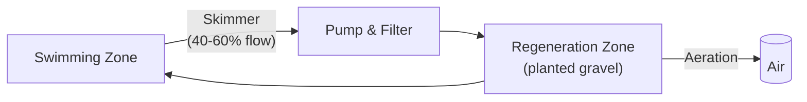
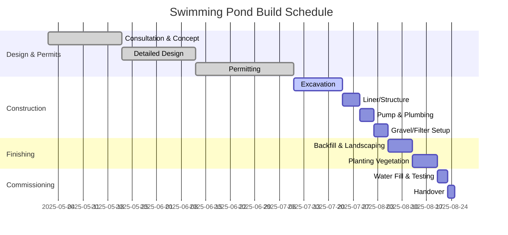

# Natural Swimming Ponds — Comprehensive Reference Guide

## Executive Summary

Natural swimming ponds (NSPs) are chemically-free pools that use ecological design — aquatic plants, gravel filters and beneficial microbes — to maintain water quality. UK trade guidelines (BANSP/IOB) require NSPs to be fully sealed (isolated from ground) and rely only on mechanical/biological purification, forbidding biocides. In practice this means separating the pool into a **swimming zone** and adjacent **regeneration (filter) zones** planted with wetland vegetation. Roughly half the pond's area is typically a planted filter, whose flora and associated biofilms consume nutrients (nitrogen, phosphorus) and suppress algae. Well-designed NSPs aim for neutral pH, drinking-water hardness, and low faecal indicator counts (e.g. ≤100 CFU/100 mL *E. coli* as per FLL standards).

This reference guide covers design principles, sizing and zoning, construction methods, filtration options, planting palettes by depth zone, water chemistry, hydraulic calculations, UK safety/regulatory issues, accessibility, maintenance regimes, cost ranges, implementation steps, and case studies from UK/EU projects.

---

## 1. Design Principles and Ecology

Natural ponds function as **self-sustaining ecosystems**. They replace chlorine with *biological* cleaning: aquatic plants and biofilms filter out organics and nutrients. Key design principles (per BANSP/IOB) include:

- **Sealed construction** — the pool must be fully isolated from surrounding ground to avoid groundwater seepage
- **Zoned layout** — separate swimming zone from planted treatment zones
- **No biocides** — only mechanical and biological treatment
- **Inert materials** — construction materials must not leach pollutants
- **Exclude runoff** — all fertiliser and surface runoff from surrounding land must be kept out (even a few grams of lawn fertiliser can overload the system with phosphorus and trigger algal blooms)
- **No fish or ducks** — to avoid nutrient loading

Ecologically, a pond provides habitat and biodiversity. Its design often includes logs, rocks and shallow "beaches" to support wildlife (frogs, newts, insects), while avoiding invasive exotics. Materials should follow circular-economy principles (reused/recycled). NSP water quality can match strict standards: studies show biofilters can reduce pathogens and nutrient loads to meet WHO bathing guidelines. In operation, NSPs conserve water and energy: the water is never dumped (aside from top-ups) and small pumps suffice.

---

## 2. Sizing and Zoning

### Two Main Zones

| Zone | Purpose | Typical depth |
|------|---------|---------------|
| **Swimming zone** | Deep, clear water for bathing | 1.5-2.5 m |
| **Regeneration zone** | Shallow, planted area for biological filtration | 0.3-1.0 m |

### Proportions

- Swim area should not exceed ~50-70% of total water surface
- Common rule-of-thumb: **1:1 ratio** swim:plant area
- UK designers typically make swim zone at least 35-50 m² for effective use
- Larger facilities (100-300 m²+) are common for multiple users

**Examples:**
- Biotop UK family pool: 140 m² swim zone + 75 m² filter
- Lincolnshire project: 111 m² swim + 168 m² regeneration (total 279 m²)
- 40 m² swimming at 2-3 m depth with equal 40 m² regen at ~1 m depth

### Depth Guidelines

| Zone | Recommended Depth | Notes |
|------|-------------------|-------|
| Swimming zone | 1.5-2.5 m | Stability, thermocline, diving (if ≥2.5 m). Deep bottom drain recommended. |
| Shallow beaches/steps | 0.2-0.5 m | Improve access for children and mobility-impaired |
| Regeneration beds | 0.3-1.0 m | German/US guides cite 0.6-1 m of gravel depth for bacteria |

### Layout Guidelines

- Strictly separate human/swim zones from treatment zones (per BANSP/IOB)
- Provide surface skimmers and drains in the swim area
- Direct overflow or pump suction to the filter area
- Ensure gentle hydraulic flow between zones (aerated waterfall or spillway)
- Avoid shade or runoff from roofs/trees falling into the regeneration zone
- Place pond with ample sunlight and clear of overhanging trees
- Hardscape: non-slip surfaces, handrails where needed
- Accessibility features: gentle ramps, wide steps, hoists or sloped entries

---

## 3. Construction Methods and Materials

### Excavation and Structure

The pool is excavated to prescribed depths, then sealed. The base must be fully isolated from surrounding ground. Common sealing methods:

| Material | Description | Advantages | Disadvantages |
|----------|-------------|------------|---------------|
| **EPDM Rubber** | Flexible synthetic membrane (≥1.0 mm) | Very durable (30+ years), flexible, UV/ozone resistant, seam-weldable. Relatively quick to install. | Higher material cost. Must guard against punctures. |
| **Concrete Shell** | Cast reinforced concrete basin with sealant | Extremely robust; integrates steps, seats, finishes. Virtually maintenance-free. | Very high construction cost. Requires skilled labour and longer curing. Prone to cracking (freeze/thaw). Lime leaching can raise pH. |
| **Bentonite Clay** | Natural clay layer (sodium bentonite) compacted under liner | Natural, non-toxic, self-healing seal if intact. | Works only with high-clay soils. Very sensitive to drying. Thick layer needed (≥10 cm). |
| **PVC-P** | Welded PVC sheets | Common in Central Europe; cost-effective; local installers familiar. | Less flexible than EPDM; shorter lifespan. |

**Example:** The Lincolnshire natural swimming pond (2015) used reinforced concrete walls and floor, lined with a black TPO membrane, with sandstone coping and timber decking.

### Substrate Layers

In planted zones, a layered substrate is placed over the liner:
1. Geotextile fabric over liner
2. Graded gravel bed (coarse at bottom, fines at top), 0.6-1.0 m total depth
3. Optional thin layer of sand/organic soil on top for planting

The gravel supports bacteria and anchors plant roots. In the swim zone, the liner may be covered with non-slip tiles, plaster, or left bare.

### Plumbing and Fittings

- At least one skimmer (surface suction) and main drain in swim area
- Pump(s) sized for 12-48 hour turnover
- Pipes feed the regeneration zone via overflow (weir/spillway) or direct pumping
- Electrical supply and bonding per UK wiring regs (Part P, 18th Edition)
- Optional UV or phosphate filters downstream of biological filter
- All penetrations through liner must be welded or mechanically sealed

---

## 4. Filtration Systems

Natural pools employ **multiple filtration stages**, prioritising biological processes.

### Options Comparison

| System | How It Works | Advantages | Considerations |
|--------|-------------|------------|----------------|
| **Planted Regeneration Zone** | Water flows through gravel and plant roots. Biofilms consume organics; plants absorb N, P. | Fully natural; creates habitat and aesthetic. Chemical-free. Low running cost. | Requires ≥30-50% of area. Takes weeks to establish. Seasonal plant management needed. |
| **Biofilter (Media)** | Pumped water through engineered media (sand, matrix, mineral beds). Bacteria on media degrade organics. | Compact, reliable nutrient removal. Works continuously. Good for specific pollutants (e.g. phosphate). | Needs power and plumbing. Media clogs — requires periodic backwashing. |
| **Mechanical/Skimmer** | Skimmers and fine filters capture debris. | Immediate removal of leaves, suspended solids. | Energy costs. Doesn't remove nutrients. |
| **UV Steriliser** | Inline UV lamp kills microbes in flow. | Kills algae/bacteria; chemical-free. Rapid clarity. | No residual effect. Requires clear water upstream. Can harm beneficial biofilter bacteria if overused. Lamp replacement. |
| **Ozonator** | Ozone gas injection oxidizes bacteria, viruses, organics. | Very strong disinfection. No chemical leftovers (ozone reverts to O₂). | No lasting sanitiser. Expensive equipment. Safety considerations. Mixing/degassing needed. |
| **Phosphate Media** | Mineral media (e.g. PhosTec, Phoslock) to bind phosphate. | Lowers nutrient levels; helps prevent algae. | Consumable (needs periodic replacement). |

### Design Models

Fluidra identifies three approaches:
- **"Pure Nature"** — large planted wetland only (no mechanical filter)
- **"Natural"** — plants + low-power filter + UV
- **"Crystal"** — full filtration with backwash for crystal clarity

In practice, many ponds use a **hybrid system**: a large planted filter as primary, supplemented by a small UV or phosphate filter for extra clarity.

### Circulation

- Target: 50-100% of pool volume per day (full turnover in 12-48 hours)
- Higher flows help during summer or after rain
- Place return jet to promote complete mixing
- Surface skimmers and fixed bottom drains together maximise debris collection


*Figure: Water circulation in a natural pond.*

---

## 5. Planting Palettes by Depth Zone

Aquatic planting is chosen for both aesthetics and filtration function. Use native UK/European species — no invasives, no tropical exotics.

### Deep Water Zone (60 cm+)

Fully submerged or floating plants. Oxygenators and shade providers.

| Species | Common Name | Function |
|---------|-------------|----------|
| *Ceratophyllum demersum* | Hornwort | Oxygenator |
| *Ranunculus aquatilis* | Water Crowfoot | Oxygenator |
| *Myriophyllum spicatum* | Water Milfoil | Oxygenator |
| *Nymphaea alba* | Hardy Water Lily | Shade (suppresses algae), aesthetics |
| *Aponogeton distachyos* | Water Hawthorn | Flowering oxygenator (mild areas only) |

### Shallow Water Zone (30-60 cm)

Marginal aquatics with dense roots that stabilise banks and uptake nutrients.

| Species | Common Name | Function |
|---------|-------------|----------|
| *Pontederia cordata* | Pickerel Weed | Purple flowers, nutrient uptake |
| *Iris pseudacorus* | Yellow Flag Iris | Strong nutrient uptake, bank stabilisation |
| *Acorus calamus* | Sweet Flag | Aromatic, nutrient uptake |
| *Mentha aquatica* | Water Mint | Fine nutrient uptake, fragrant |

### Marginal Zone (0-30 cm)

Emergent plants at the water's edge. Roots in saturated substrate, foliage above waterline.

| Species | Common Name | Function |
|---------|-------------|----------|
| *Caltha palustris* | Marsh Marigold | Yellow spring blooms |
| *Juncus effusus* | Soft Rush | Structural, bank stabilisation |
| *Myosotis scorpioides* | Water Forget-me-not | Edge softening, blue flowers |
| *Butomus umbellatus* | Flowering Rush | Pink flowers, wildlife |
| *Lysimachia nummularia* | Creeping Jenny | Ground cover |
| *Ranunculus flammula* | Lesser Spearwort | Edge planting |
| *Lythrum salicaria* | Purple Loosestrife | Tall, purple spikes |
| *Filipendula ulmaria* | Meadowsweet | Fragrant, attracts pollinators |
| *Typha latifolia* | Bulrush | Tall, structural |
| *Carex* spp. | Sedges | Edge planting, diversity |

### Planting Guidelines

- **Density:** 4-5 plants per m² in regeneration beds (1 m spacing)
- **Goal:** ~100% cover of shallow beds by summer
- At least one-third of water surface should be planted
- Plant in spring (April-June) to establish
- Group by depth requirements; consider spring vs. summer flowering
- Keep swim area free of large plants
- Dense planting at edges provides year-round habitat and privacy
- In autumn, cut back dead growth and remove debris to avoid nutrient release
- Overwintering is natural (plants go dormant, roots remain)

### UK Suppliers

- Waterside Nursery
- Devon Pond Plants (~5 plants/m² recommended, ~£20-30/m²)
- Park Corner Aquatic / Park Corner Nurseries
- Roots Plants

---

## 6. Water Chemistry and Balance

### Nutrients (N, P)

Phosphates are the main enemy. Plants and filters should remove nearly all P. External sources must be minimised:
- Avoid fertiliser or runoff
- Remove leaves and organic debris promptly
- Seed biofilter with beneficial bacteria in spring (commercial "pool starter" products)

### pH and Hardness

- Target pH: 6.5-8.5 (NSPs often settle near 7.0-7.5)
- Hardness: ~8-12° dH (per FLL recommendations)
- Test fill/drinking water chemistry before filling (per BANSP)
- After filling, test pH, total alkalinity and hardness monthly

### Microbial (Hygiene)

- Biofilters "cleanse" pathogens through beneficial biofilms
- German FLL guideline (2017): max 100 CFU/100 mL *E. coli*
- Public pools: regular testing for *E. coli*, enterococci, *P. aeruginosa* is mandated
- Private: test periodically (quarterly or after contamination)
- If faecal contamination occurs: short pool closure or emergency UV shock

### Algae Control

- Some planktonic/string algae is normal and seasonal
- Good circulation, plant cover (lilies shade light), regular skimming prevent blooms
- Barley straw is an eco-friendly algicide (releases humic compounds)
- Increasing plant cover or circulation usually resolves green water
- A bit of clear algae often indicates a healthy ecosystem

### Testing Regime

- Test fill and make-up water for minerals/contaminants (per BANSP)
- Monthly: pH, nitrates, phosphates
- Rising P indicates an outside source
- Public facilities: weekly lab tests per Bathing Water Regulations (2013)
- Private: in-house dipslide kits and occasional lab checks
- Keep a log of water chemistry and maintenance

---

## 7. Hydraulics and Pump Sizing

### Turnover Guidelines

- Recirculate entire pond volume at least every 12-24 hours
- 1-2 turnovers per day is common practice
- Higher flows during summer or after rain

### Sizing Formula

```
Required flow (L/h) = Volume (L) / Desired turnover time (h)
```

### Example Calculations

| Pond | Volume | Turnover | Required Flow |
|------|--------|----------|---------------|
| Small (50 m², avg 1.5m) | 75 m³ | 12 h | ~6,250 L/h |
| Medium (100 m³) | 100 m³ | 12 h | ~8,300 L/h |
| Large (200 m² swim + 200 m² regen) | 600 m³ | 12 h | ~50,000 L/h |

For the large example, a practical design might use a pump rated 20-30 m³/h continuously (for ~2x turnover/day) plus smaller gravity flow to filter beds.

### Design Notes

- Always add head (pipe friction, elevation) and use pump curves
- Flow is typically split: some through vegetation beds by gravity, most pumped through filter
- Circulation prevents stagnation and distributes oxygen
- Very high flows can disturb shallow plants — balance is needed
- All pump wiring must be on GFCI/RCD circuits

---

## 8. Safety and Regulations (UK/EU Context)

### Structural Safety

- Permanent pool construction requires Building Regulation approval (England/Wales)
- No specific UK standard for "natural pools" — NSP builders follow BS EN 15288 (pool safety) and BS 8510 (non-slip finishes)
- The NSP is treated like an engineered pool for structural purposes

### Barriers and Access

- No legal UK minimum for domestic pool fencing
- **RLSS UK recommends:** secure barrier ≥1.2 m high with self-closing gates to prevent unsupervised child access
- Best practice: 1.2-1.5 m enclosure/gate
- Gaps must be small (no footholds), climbing-resistant
- All stairs and ramps should be slip-resistant
- Designs compliant with Equality Act and BS 8300 (pool lifts, wide slopes)

### Signage and Safety Equipment

- Standard signs: "No Lifeguard — Swim at Your Own Risk", depth warnings, "No Diving" if shallow
- British Standard signage (EN ISO 7010)
- Post rules near pond (no glass, supervision rules)
- Rescue equipment: pole, ring buoy
- Alarm system and emergency instructions recommended

### Supervision

- RLSS: never allow children <16 to swim without an adult (typically 2:1 adult:child ratio)
- PWTAG: discourage lone bathing
- Commercial/public ponds: lifeguards with RLSS or STA qualifications required
- Private: optional but good practice for groups

### Electrical Safety

- Pumps and lights: Part P of UK wiring regulations (18th Edition)
- All motors bonded/earthed as for pools
- GFCI/RCD protection on circuits
- Underwater lights: safe low-voltage transformers

### Water Quality Regulation

- Private natural pond is not a statutory "bathing water"
- No automatic requirement for lifeguard or shower
- If open to public/club members: local health authority inspections apply
- King's Cross Pond Club (London) operates under strict European Bathing Water standards with lifeguard, changing rooms

### Planning Permission

- Most garden ponds do not need planning permission
- Check if in protected area (AONB, listed building) or if significant structures involved
- Check with local council
- In Czech Republic: check whether ohlášení stavby or stavební povolení is required

### Other

- Noise from pumps must meet environmental limits
- Waste water from backwashing must go to foul drain (not storm drains)

---

## 9. Accessibility

- At least one gently graded entry (beach or ramp) for less-abled swimmers
- Paths and deck surfaces: wide, level, non-slip
- Handrails or pool lifts in deeper sections for elderly/wheelchair users
- Seating at varying heights adjacent to water
- Avoid vertical drop-offs or hidden ledges
- All equipment in lockable, covered housing to avoid trip hazards

---

## 10. Maintenance Schedules

### Seasonal Routine

| Season | Tasks |
|--------|-------|
| **Spring** | Clear winter debris (leaves, algae mats). Start pumps/filters. Prune dead plant material, divide overcrowded plants. Test water chemistry (pH, nitrates, phosphates). Top up with dechlorinated water. Seed biofilter with bacteria starters. Lay barley straw if needed. |
| **Summer** | Skim daily/weekly for debris. Trim encroaching plants. Monitor water levels (evaporation ~5 mm/day); refill with rainwater or dechlorinated tap water. Inspect pumps, clean skimmer baskets weekly. If cloudy, add more oxygenating plants or shade (float lilies). |
| **Autumn** | Fit leaf net or barrier in October. Cut back most plants to just above water. Inspect and clean pumps/filters. Test water quality. |
| **Winter** | No draining needed (UK/mild climates). Keep a small hole in any ice for gas exchange. Run pumps on timer or use floating de-icer. Check after storms. |

### Regular Checklist

- **Weekly (summer) / Monthly (winter):** skim debris, empty skimmer baskets, check pump, inspect UV bulb (if installed), monitor plant health
- **Annual "spring clean":** vacuum sediment from swim floor, add new plants if sparse, replace some filter media

### Time Commitment

Most owners spend **15-30 minutes/week** in summer (vs. 2-4 hours for chlorinated pools). An annual professional service is recommended.

### Annual Service Includes

Full vacuuming of substrate, cleaning liners, replacing filter media, inspecting pump/UV, water testing. Every 3-5 years a deep clean may involve fully draining the pool.

### Algae Troubleshooting

- Green water (planktonic algae): increase plant cover or circulation
- Blanketweed (filamentous): manually remove; reduce phosphate input (avoid tap water top-ups)
- Add more oxygenating plants or use pond vacuum
- UV or ozone can break algae cycles when needed
- A bit of clear algae is normal and indicates a healthy ecosystem

---

## 11. Cost Estimates (UK, 2025-26)

### By Scale

| Scale | Swim Area | Filter Area | Total Area | Indicative Cost (GBP) |
|-------|-----------|-------------|------------|-----------------------|
| Small wildlife pond | — | ~25 m² | ~50 m² | £10k-£20k |
| Small swim pond | 30-50 m² | 20-40 m² | 50-90 m² | from ~£60k |
| Medium swim pond | ~150 m² | ~100 m² | ~250 m² | ~£90k |
| Large family pond | ~300 m² | ~200 m² | 500 m²+ | >£120k |

### Cost Breakdown (Example: 50 m² swim pond)

| Item | Typical Cost |
|------|-------------|
| Excavation & site prep | £10-20k |
| EPDM Liner (50 m²) | ~£3-5k |
| Pump/Filter system | £10-25k |
| Aquatic plants (plants/soil) | ~£5-10k |
| Decking/Hardscape | £5-15k (optional) |
| **Total (50 m² swim pond)** | **~£60k+** |
| **Large estate pond** | **£100k+** |

### Cost Factors

- Site access (difficult sites need heavy equipment)
- Ground type (heavy clay vs. rock excavation)
- Liner choice
- Design features (stone coping, decking, waterfalls)
- Professional design fees (~£500-2,500)
- Local planning fees (if needed)

### Running Costs

- Annual maintenance: **£300-£1,000/year** (electricity and occasional plant replacement)
- Budget rule: ~£1,000-£1,500 per m² of total pond (budget installation); elaborate projects double that
- Planting budget is roughly equal to liner cost

---

## 12. Implementation Checklist and Timeline

### Build Phases

1. **Design & Permitting (2-6 weeks):** Engage NSP designer/landscaper. Finalise plan. Obtain planning approvals.
2. **Excavation (1-2 weeks):** Dig swimming and regeneration zones. Slope edges. Divert surface water.
3. **Liner Installation (1-3 weeks):** Apply waterproofing (EPDM, bentonite, or concrete). Ensure full sealing.
4. **Plumbing & Electrical (1 week):** Install pump(s), pipes, skimmers, drains. Run electrical feeds.
5. **Filter Beds & Substrate (1 week):** Lay geotextile and graded gravel. Add substrate layer.
6. **Planting (1-2 days):** Install aquatic plants. Mulch around roots.
7. **Filling & Start-up (4-8 weeks):** Fill slowly. Start pumps. Over 4-8 weeks, bacteria colonise. Monitor clarity. Cloudiness is normal.

**Total: 2-4 months**, weather permitting.



### Seasonal Notes

- Ideal to finish planting in spring for growth
- If built in colder months, run pumps and cover plants until warm
- Before winter, follow autumn maintenance steps

---

## 13. Case Studies (UK/EU)

### Lincolnshire Family Pool (2015)
A 16x6 m concrete pond (2.0 m deep) with 111 m² swim area and 168 m² planted zone (279 m² total). Built by Ellicar Pools using reinforced concrete with black TPO liner and sandstone coping. Planted with water mint, reeds and natives. Sandy beach for shallow entry. Won a design award for crystal-clear water.

### King's Cross Pond Club (London, 2015)
The UK's first public natural pool — a 40 m outdoor pond in central London. Operates 24/7 with lifeguards, changing rooms and showers. Water treated by marginal plants and biofilter. Crystal-clear year-round. Follows all bathing-water hygiene guidelines.

### West Sussex Private Pond
A 12x4 m fibreglass-style pond by Biotop. Band of iris and rush around edges for filtration, cedar deck. Crystal-clear water, no chemical treatment.

### Kent Swimming Pond
Family pond with beach entry and submerged step. Undergravel filtration and small biofilter. *Iris pseudacorus* and *Lythrum* ring the shallow shelf.

### Buckinghamshire Natural Pool
Shallow gravel "beach" and pool house. Heavily planted regeneration zone (flag iris, cow parsley). Skimmer feeds hidden gravel filters under deck. Won a local landscaping award.

### Hertfordshire Rectangular Pond
Modern formal design with stone edges. EPDM liner and wooden-glass-bead filters. Native plants at edges, habitat for newts.

### Naturbad Riehen (Basel, Switzerland)
Large public "swimming pond" in a park. Swim area + broad wetland regeneration with reeds and lagoon beds. Sand filters and UV for public health standards.

### Residential Examples
- Doncaster (2010): 140 m² swim + 75 m² filter
- Surrey: ~100 m² garden pond achieving fishable clarity using only plants
- Austrian/German/Swiss hotel pools (often heated) with similar designs

---

## 14. UK Suppliers and Resources

### Designers / Contractors
- **BANSP** (British Association of Natural Swimming Ponds) — member directory
- **The Swimming Pond Company** (Norfolk)
- **Ellicar Gardens** (London)
- **Clear Water Revival**
- **Biotop** (UK)

### Plant Suppliers
- Devon Pond Plants
- Waterside Nursery
- Park Corner Nurseries
- Roots Plants

### Equipment
- **BioNova** (UK) — filters
- **Certikin** — pool equipment, UV
- **Filcoten Aqua / Vision Pools** — liners
- **Firestone** — EPDM liners
- **AquaMax / BioNova** — pumps
- **Del Ozone** — ozone generators

### Standards and Guidelines
- **BANSP/IOB** — UK trade association guidelines
- **FLL** (Germany) — water quality standards for natural pools
- **PWTAG** — Pool Water Treatment Advisory Group
- **RLSS** — Royal Life Saving Society (safety)
- **BS EN 15288** — Pool safety in operation
- **BS 8510** — Non-slip finishes
